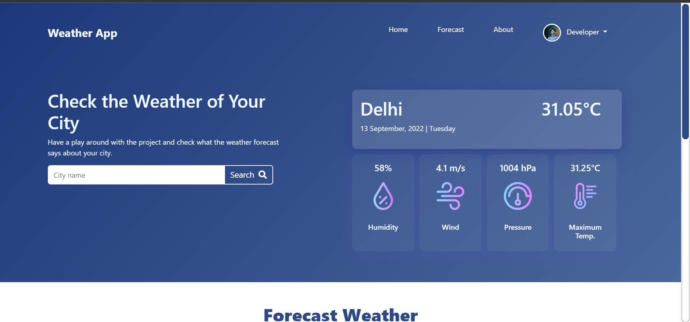

Project Name: Weather App
About: This Weather App helps to find the temperature and other weather related data of your city.
To get the data of your city follow the following step:
Step: Fill the name of your city in the search bar [Note: Make sure to spell the name of the city correctly].
Result: Now you will get the list of Information -:

1. Temperature
2. Humidity
3. Pressure
4. Wind Speed
5. Max. Temperature
Also 3 days forecast of the weather!

Technologies Used: Node JS, Express JS, EJS, CSS3 and bootstrap5
API Included: Open Weather

Date of Creation: 12/09/2022 - 13/09/2022
Special Features:
1. Tells Temperature
2. Forecasts Data of 3 Days

Click on the image to watch the Video :
;